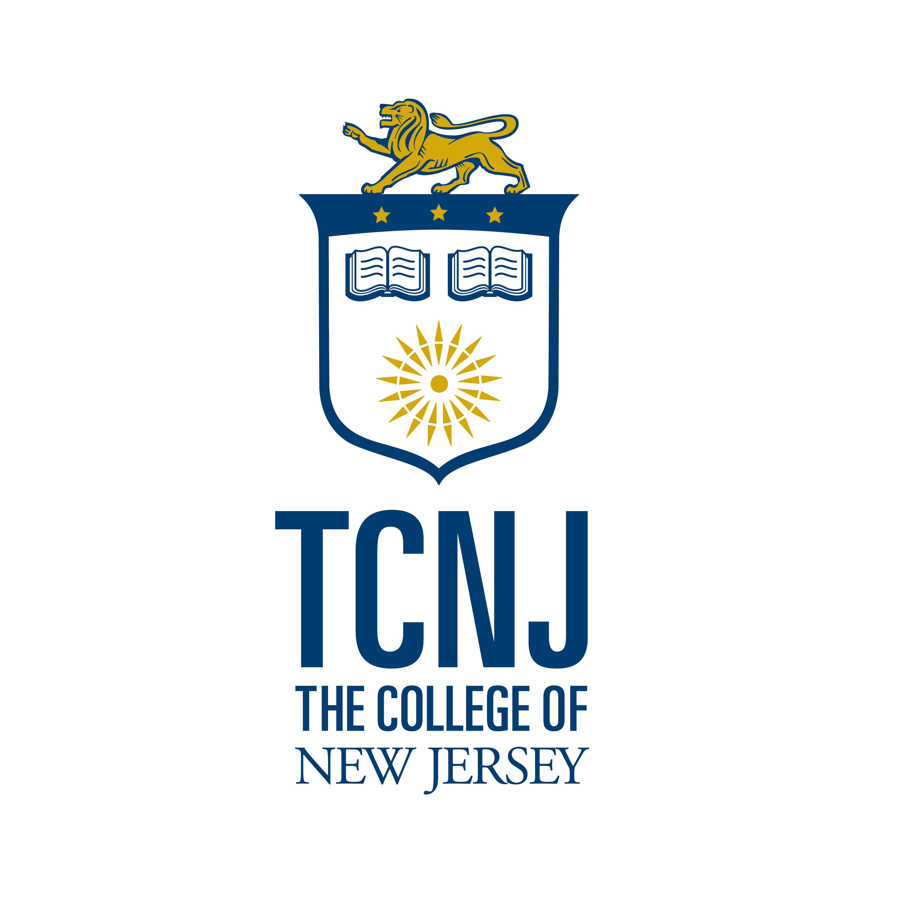
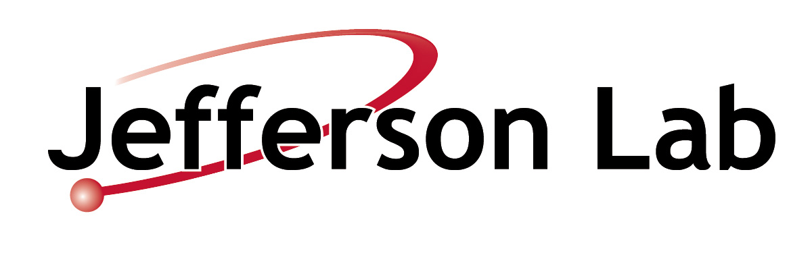

    
    

# Ali Nuclear Physics Research Wiki

> Experimental nuclear physics research at **The College of New Jersey** and **Jefferson Lab**.  
> This wiki documents analysis workflows, collaboration notes, experimental planning, and group resources.

## Research Areas

- :material-flask:{ .lg } __Research Overview__  
  General overview of the Ali Group’s nuclear physics program, scientific goals, and collaborations.

- :material-atom:{ .lg } __RG1A Experiments__  
  Documentation and updates for RG1A experiment development and analysis.

- :material-chart-line:{ .lg } __Analysis Resources__  
  ROOT scripts, analysis pipelines, detector calibration tools, and data workflows.

- :material-school:{ .lg } __EIC Physics__  
  Notes, simulation studies, and Electron-Ion Collider related projects.

---

## Group Resources

- :material-account-group:{ .lg } __Students__  
  Student researchers, project assignments, and mentoring resources.

- :material-calendar:{ .lg } __Meetings__  
  Group meeting schedules, agendas, and archived notes.

- :material-desk:{ .lg } __Hall C / NPS__  
  Experimental hall logistics, run plans, and detector setup documentation.

- :material-book-open-page-variant:{ .lg } __Markdown in 5 Minutes__  
  Quick guide for writing and editing wiki pages.

---

## Quick Links

- [Research Overview](research_overview.md)
- [Students](students.md)
- [Meetings](meetings.md)
- [Hall C / NPS](nps_hall_c.md)
- [RG1A Experiments](rg1a_experiments.md)
- [Analysis Resources](analysis_resources.md)
- [EIC Physics](eic_physics.md)
- [Markdown in 5 Minutes](markdown.md)

---

**Ali Research Group**  
The College of New Jersey • Jefferson Lab  
Experimental Nuclear Physics Documentation Portal

